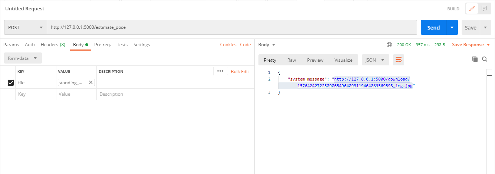
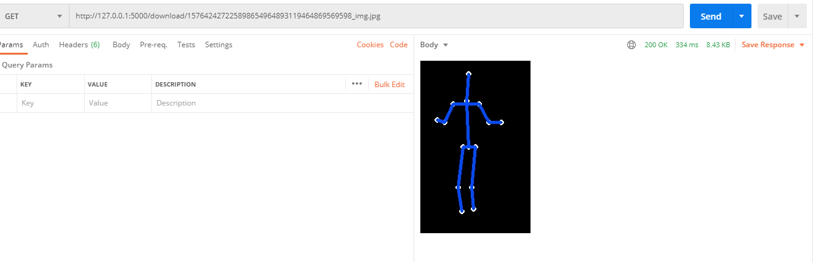
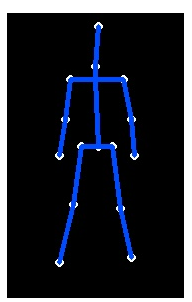
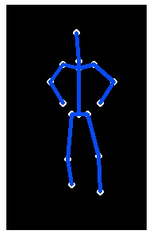
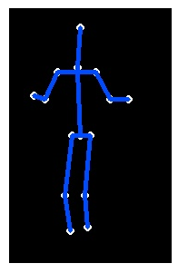

# Pose Estimator

pose_estimator (pe) is a deep learning learning system used in estimating human pose.

### Repository Breakdown:

##### INDSIDE ```ROOT``` FOLDER
1. ```app.py```: Runs the flask server.
3. ```pe```: Pose Estimator Module.
5. ```requirements.txt```: this contains the requirements configuration.


##### INSIDE THE ```pe``` FOLDER :
1. ```components```: This folder contains the key features used by pe.
   1. ```pose_estimator.py```: This module performs pose estimation.
   2. ```ext_lib```: This folder contains external scripts to run the pose estimator module. [SOURCE_LINK](https://github.com/microsoft/human-pose-estimation.pytorch)
2. ```utils```: Contains utility scripts used through out the system.
      1. ```system_utils.py```:This module holds general utility functions.
3. ```pe_connect.py```: This module integrates flasks blueprint.
4. ```config```: This folder contains the necessary configuration files.
      1. ```deploy_config.py```: This module holds deployment configuration.
      2. ```system_config.py```: This module holds system configuration.
5. ```models```: This folder contains the model files files.
      1. ```config```: This folder holds model configuration file.
      2. ```model```: This folder holds the serialized model.
  
### How to run the reflectly machine learning system (MLS) locally:
1. Create and activate a virtual environment: 
    1.  Create venv:

        i. ```python3 -m venv _name_of_virtual_env_```
    2.  Activate venv:
       
         i. ```source _name_of_virtual_env_/Scripts/activate``` (windows-git terminal)
        
         ii. ```source _name_of_virtual_env_/bin/activate``` (linux terminal)
2. Install dependencies using: ```pip install -r requirements.txt```.
3. Download the model from [here](https://drive.google.com/file/d/15nd15Bofqx9XfhCD8QMFLR-cKa79dFtN/view?usp=sharing) and place it in this directory: ```pe/models/model/```. 
4. Run the server locally using: ```python app.py```

## API ENDPOINTS
1. pe_alive (```GET```) : ```http://127.0.0.1:5000/pe_alive```;```TESTED```.
2. estimate_pose (```POST```) : ```http://127.0.0.1:5000/estimate_pose```;```TESTED```.
3. download (```GET```):```http://127.0.0.1:5000/download/<path:file_name>```;```TESTED```.

### How to make requests to the deployed application:
1.  estimate_pose (```POST```): Using postman, upload the data as form data, where the key value is ```file```.


2. download (```GET```): Copy the link returned in step one and place on the web browser or make a get request using postman.


### Sample Images:
Original Samples:


Pose Estimate Samples:






